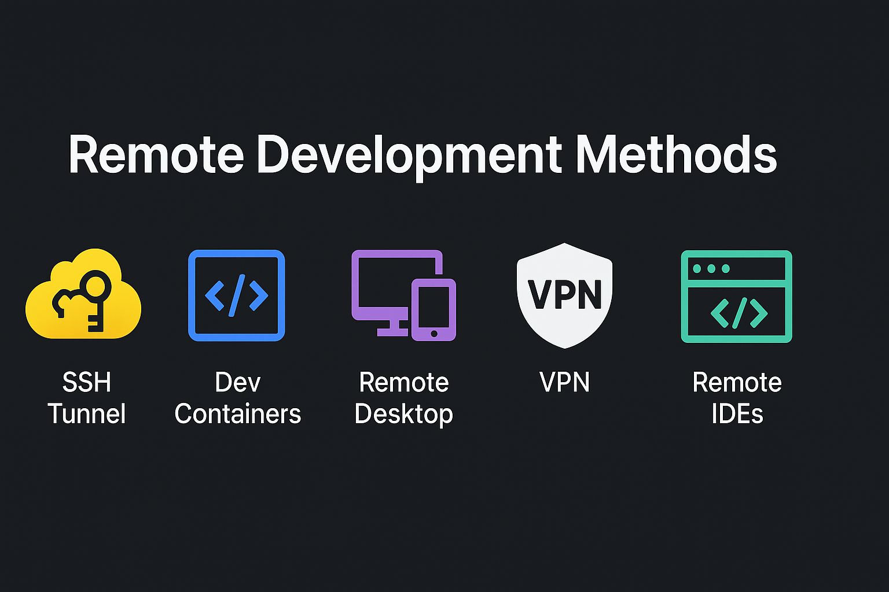

# 🔐🧑‍💻 Remote Development & Secure Connectivity Methods

> **Author**: [Sharique55](https://github.com/Sharique55)  
> ⭐ Star this repository to bookmark a one-stop reference for modern remote development workflows and secure connectivity techniques.

---

<!-- [](https://github.com/Sharique55/remote-dev-methods) -->


---

## 📌 Table of Contents

- [🌉 SSH Tunnel](#-ssh-tunnel)
- [📦 Dev Containers](#-dev-containers)
- [🖥️ Remote Desktop Protocol (RDP)](#️-remote-desktop-protocol-rdp)
- [🛡️ Virtual Private Network (VPN)](#️-virtual-private-network-vpn)
- [💻 Virtual Machines (VMs)](#-virtual-machines-vms)
- [💡 Remote IDEs](#-remote-ides)
- [🐞 Remote Debugging Tools](#-remote-debugging-tools)
- [🔄 File Sync & Remote Execution](#-file-sync--remote-execution)
- [☁️ Cloud-Based Development Environments](#️-cloud-based-development-environments)
- [📊 Summary Table](#-summary-table)

---

## 🌉 SSH Tunnel

A secure method to forward ports and access restricted remote services. It's fast, encrypted, and works without any GUI.

**Use Cases**
- Secure access to remote DBs.
- Tunnel HTTP/HTTPS over firewalls.

**Example Command:**
```bash
ssh -L 3306:localhost:3306 user@remote-server
```

---

## 📦 Dev Containers

Containerized dev environments using Docker. Ideal for ensuring consistency across teams.

**Tools**: Docker + VS Code (Remote - Containers extension)

**devcontainer.json Example:**
```json
{
  "name": "Node Dev Env",
  "image": "mcr.microsoft.com/vscode/devcontainers/javascript-node",
  "settings": {},
  "extensions": ["dbaeumer.vscode-eslint"]
}
```

Click Here to know more about Dev Containers ==>  [🧩 Dev Containers: The Complete Guide](dev_containers_guide.md)

---

## 🖥️ Remote Desktop Protocol (RDP)

GUI-based access to remote machines.

**Use Cases**
- Windows server management
- GUI software testing

**Popular Tools**
- Microsoft RDP
- AnyDesk, Chrome Remote Desktop

---

## 🛡️ Virtual Private Network (VPN)

Secures communication and allows access to private/internal networks.

**Use Cases**
- Company intranet access
- Secure browsing

**Tools**
- OpenVPN, WireGuard, Cisco AnyConnect

---

## 💻 Virtual Machines (VMs)

Isolated full OS instances.

**Use Cases**
- Test environments
- Running multiple OSes

**Popular Tools**
- VirtualBox, VMware, Hyper-V

---

## 💡 Remote IDEs

Cloud-hosted or server-run IDEs for code editing.

**Examples**
- GitHub Codespaces  🧩 [How to Create Your Own GitHub Codespace Configuration](https://gist.github.com/Sharique55/06c8666033e56aacb75084e8ba88e609) 🧩
- AWS Cloud9
- Replit

**Benefits**
- No local setup
- Collaborate anywhere

---

## 🐞 Remote Debugging Tools

Debug applications running remotely.

**Tools**
- VS Code Remote Debug
- IntelliJ Remote Debug

**Use Case**
- Kubernetes microservice debugging

---

## 🔄 File Sync & Remote Execution

Use tools like `rsync`, `scp`, or `ssh` to copy and run code remotely without full containerization.

**Example:**
```bash
rsync -avz ./project/ user@remote:/home/user/project/
ssh user@remote 'cd /home/user/project && ./run.sh'
```

---

## ☁️ Cloud-Based Development Environments

Fully online development environments.

**Popular Platforms:**
- [GitHub Codespaces](https://github.com/features/codespaces)
- [AWS Cloud9](https://aws.amazon.com/cloud9/)
- [Google Cloud Shell](https://cloud.google.com/shell)

---

## 📊 Summary Table

| Feature               | SSH Tunnel                          | Dev Containers                      | Others                        |
|-----------------------|--------------------------------------|-------------------------------------|-------------------------------|
| Purpose               | Secure access to remote services     | Containerized dev environments      | Remote GUI, Cloud IDE, VPN    |
| Isolation             | Low                                  | High                                | Varies                        |
| Setup Complexity      | Low                                  | Medium                              | Varies                        |
| Portability           | High                                 | High                                | Varies                        |
| Use Case              | DB tunnel, secure port forward       | Coding with isolated toolchains     | Remote access, debugging      |

---

## 📎 Contribute / Fork / Star

If this repo helped you:
- ⭐ Star it to bookmark it.
- 🍴 Fork it to build your own remote dev setup!
- 💬 Open an Issue for suggestions or questions.

---

## 📢 License

MIT License — free to use, modify, and share.

> Made with ❤️ by [@Sharique55](https://github.com/Sharique55)

---
# Tags

#RemoteDevelopment #DevContainers #SSHTunnel #CloudIDE #VSCode #VPN #VM #GitHubCodespaces #Docker #RemoteDebugging #CloudDevelopment #InfrastructureAsCode #DevOps #DeveloperTools


